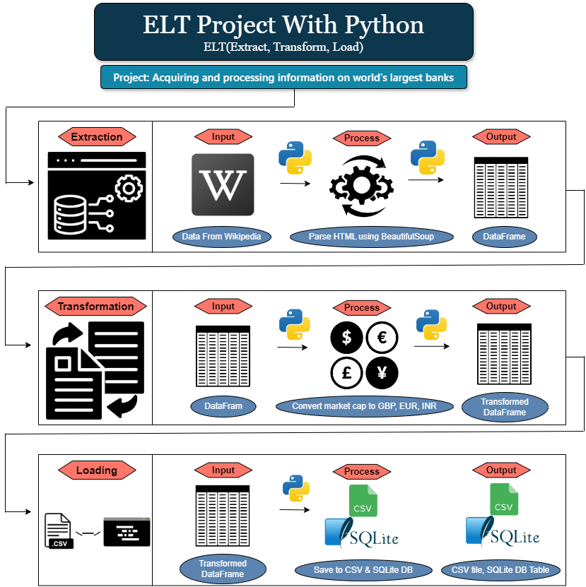

<div align="center">

<h1>🏦 ETL Python Project</h1>

<p>
<b>Python ETL pipeline for extracting the world's largest banks by market capitalization, transforming currency values, and loading results into CSV and SQLite.</b>
</p>

<p>


</p>

</div>

---



## 📌 Project Overview

This project demonstrates a complete **Extract, Transform, Load (ETL)** workflow using Python.

The pipeline extracts data about the world's largest banks from an archived Wikipedia page, transforms market capitalization values into multiple currencies using exchange rates, saves the processed dataset as a CSV file, loads it into a SQLite database, and runs SQL queries for validation.

---

## 🎯 Objectives

- Extract bank market capitalization data from a web page
- Parse HTML tables using BeautifulSoup and Pandas
- Transform market capitalization from USD into GBP, EUR, and INR
- Save the transformed data into a CSV file
- Load the final dataset into a SQLite database
- Execute SQL queries for validation
- Maintain a log file for ETL pipeline progress

---

## 🔄 ETL Workflow

```text
Wikipedia Web Page
        │
        ▼
Extract HTML Table
        │
        ▼
Pandas DataFrame
        │
        ▼
Currency Transformation
        │
        ▼
Largest_banks_data.csv
        │
        ▼
SQLite Database
        │
        ▼
Validation Queries
```

---

## 📁 Project Structure

```text
ETL-Python-Project/
│
├── datasets/
│   ├── Banks.db
│   ├── Largest_banks_data.csv
│   └── exchange_rate.csv
│
├── banks_project.ipynb
├── code_log.txt
├── README.md
├── LICENSE
└── .gitignore
```

---

## 📊 Dataset Output

The final CSV file is stored at:

```text
datasets/Largest_banks_data.csv
```

### Output Columns

| Column | Description |
|---|---|
| `Rank` | Bank ranking by market capitalization |
| `Bank name` | Name of the bank |
| `Market cap (US$ billion)` | Market capitalization in USD billions |
| `MC_GBP_Billion` | Market capitalization converted to GBP billions |
| `MC_EUR_Billion` | Market capitalization converted to EUR billions |
| `MC_INR_Billion` | Market capitalization converted to INR billions |

---

## 💱 Exchange Rate File

Exchange rates are stored in:

```text
datasets/exchange_rate.csv
```

Example currencies used:

| Currency | Purpose |
|---|---|
| GBP | British Pound conversion |
| EUR | Euro conversion |
| INR | Indian Rupee conversion |

---

## 🗃️ SQLite Database

The transformed data is loaded into:

```text
datasets/Banks.db
```

Database table:

```text
Largest_banks
```

---

## 🧪 Validation Queries

The notebook runs SQL queries such as:

```sql
SELECT * FROM Largest_banks;
```

```sql
SELECT AVG(MC_GBP_Billion) FROM Largest_banks;
```

```sql
SELECT "Bank name" FROM Largest_banks LIMIT 5;
```

---

## 📝 Logging

Pipeline execution logs are stored in:

```text
code_log.txt
```

The log file records each major ETL stage:

- Preliminaries started
- Data extraction completed
- Data transformation completed
- Data saved to CSV
- Data loaded to database
- SQL queries executed

---

## 🚀 How to Run

### 1. Clone the repository

```bash
git clone https://github.com/CodeByMan/ETL-Python-Project.git
cd ETL-Python-Project
```

### 2. Create a virtual environment

```bash
python -m venv venv
```

Activate it:

```bash
venv\Scripts\activate
```

For macOS/Linux:

```bash
source venv/bin/activate
```

### 3. Install dependencies

```bash
pip install pandas requests beautifulsoup4 lxml
```

### 4. Open the notebook

```bash
jupyter notebook banks_project.ipynb
```

Run all cells to execute the ETL pipeline.

---

## 🛠️ Technologies Used

| Technology | Purpose |
|---|---|
| Python | Main programming language |
| Requests | Fetch web page content |
| BeautifulSoup | Parse HTML content |
| Pandas | Extract and transform tabular data |
| SQLite | Store transformed data |
| Jupyter Notebook | Develop and run ETL workflow |
| CSV | Store exchange rates and output data |

---

## 📌 Key Learning Outcomes

- Building a basic ETL pipeline with Python
- Web scraping tabular data
- Cleaning and transforming financial data
- Using external exchange rate files
- Loading data into SQLite
- Running SQL queries from Python
- Maintaining ETL execution logs

---

## 👤 Author

**Muhammad Ali Nawaz**  
Cloud Data Engineer

---

## 📄 License

This project is licensed under the [MIT License](LICENSE).

---

<p align="center">
<b>⭐ If you found this project useful, consider giving it a star!</b>
</p>
